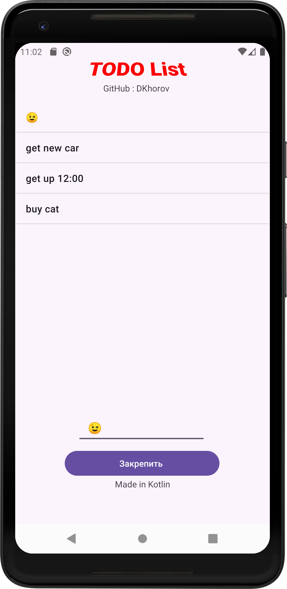

# Todo list Kotlin
To-do лист – это инструмент для планирования задач и управления временем. Он помогает структурировать ваши дела и следить за их выполнением.
Вот несколько основных характеристик и преимуществ to-do листов:
Организация задач: Записывая все свои задачи, вы можете легко увидеть, что нужно сделать, и расставить приоритеты.
Управление временем: To-do листы помогают распределить ваше время более эффективно, планируя каждый день и неделю.
Удовлетворение от выполнения: Отметка выполненных задач приносит чувство завершенности и мотивации.
Гибкость: Вы можете добавлять, удалять и изменять задачи по мере необходимости.
Визуализация прогресса: Видеть свой прогресс на бумаге или в приложении может помочь вам держать фокус и оставаться продуктивным.

## Скриншот

## Автор DKhorov 
